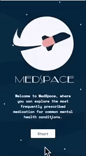

# Med-Space

## About MedSpace

Welcome to Med-Space, where you can explore the most frequently prescribed medication for common mental health conditions. This will hopefully help you to talk to your clinician about your treatment options and what might be useful in addressing the difficulties you are facing.

## Conditions included in the app

- OCD – Difficulties in controlling obsessive thoughts and compulsive behaviours
- Depression – Difficulties with low mood
- ADHD – Difficulties with concentration, impulsivity and activity levels
- Anxiety – Difficulties with overwhelming worry in different situations
- Psychosis – Difficulties with perception or interpretation of events

## Medications included in the app
- OCD: Citalopram, Sertraline, Fluoxetine
- Depression: Citalopram, Sertraline, Fluoxetine, Amitryptaline, Lithium
- ADHD: Atomoxetine (Strattera), Methylphenidate (Concerta, Medikinet, Equasy, Ritalin)
- Anxiety: Chlorpromazine, Diazepam,
- Psychosis: Chlorpromazine, Olanzapine, Quetiapine, Aripiprazole

## Tech stack for the prototype
- react
- react-router
- styled-components
